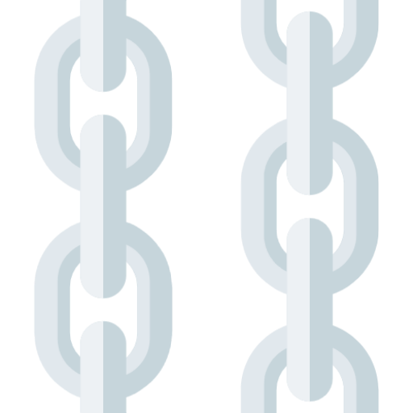
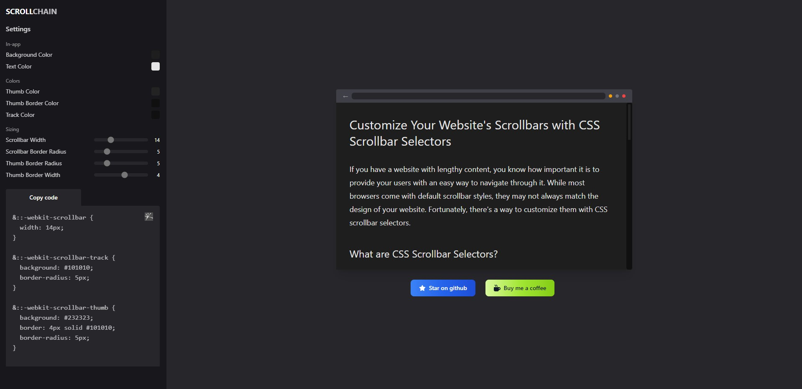

<h1 align="left"><a href="https://scrollchain.vercel.app"></a>ScrollChain </h1>

<a href="https://scrollchain.vercel.app"></a>

<p align="left">
  
  
  
  
</p>
<br>

## About

Simple web app to create your custom scrollbar styles.

## Project Setup

```sh
npm install
```

### Development Server

```sh
npm run dev
```

### Compile and Minify for Production

```sh
npm run build
```

### Preview Production Build

```sh
npm run preview
```
